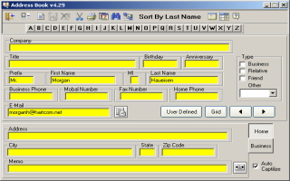



## Address Book v4\.2 ADO

### Description

Update 11-29-03, Address Book with VCard import/export; save both business and home addresses, phone numbers; send an email using your default email app, dial the phone number, many ways to sort your information. In the DAO version, several people had problems getting the application to open the database. This was due to differences in machine configurations that would normally have been solved during an installation.

This was written several years ago. I don’t use it anymore and decided to clean it up, convert it to use ADO and post it on PSC. Hope you find it useful. Please see the ReadMe file.
 
### More Info
 

             |
---                |---
**Submitted On**   |2003-11-29 22:38:00
**By**             |[Morgan Haueisen](https://github.com/Planet-Source-Code/PSCIndex/blob/master/ByAuthor/morgan-haueisen.md)
**Level**          |Advanced
**User Rating**    |4.9 (44 globes from 9 users)
**Compatibility**  |VB 6\.0
**Category**       |[Complete Applications](https://github.com/Planet-Source-Code/PSCIndex/blob/master/ByCategory/complete-applications__1-27.md)
**World**          |[Visual Basic](https://github.com/Planet-Source-Code/PSCIndex/blob/master/ByWorld/visual-basic.md)
**Archive File**   |[Address\_Bo16780211302003\.zip](https://github.com/Planet-Source-Code/morgan-haueisen-address-book-v4-2-ado__1-46264/archive/master.zip)

